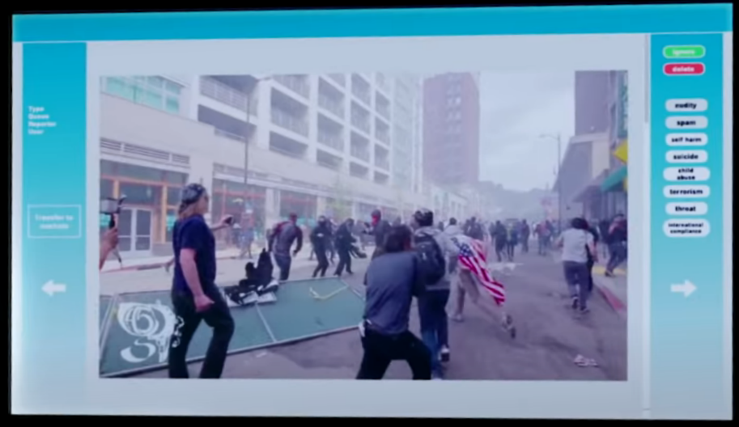

# CLEANER
This is a web game where the user must take on the role of a content moderator and filter out content from the internet. 

Try it [here](https://atienn.github.io/CART-263/P1/).

## Artist Statement
### Basis
This project has its basis in the documentary The Cleaners, which exposes how mega social media corporations keep their platforms clean (among other things). In short, they do so by outsourcing the work of content moderation to third-world countries. ‘Cleaners’ there are subject to some of the worst horrors of the internet and must continuously make calls as to whether to delete / censor content or to keep it up.

In this browser game, the user takes on the role of such a ‘cleaner’. Obviously, though I don’t want to subject people to what actual content moderators see (nor do I want to try and seek it out myself) and so the game takes on a much milder theme.

### Purpose
The point of this project is simply to remind users that this kind of content moderation exists and is necessary for us to enjoy platforms largely devoid of toxicity.

To further hint at the connection, I made sure to model the whole interface after what actual ‘cleaners’ are shown to use within the documentary (see below).

Interface used by content moderators as depicted in the documentary.

### Content
Moreover, I believe that even if the displayed content was much milder, it was crucial to pull the content from an actual social media platform (Flickr in this case). This is quite akin to making training data sets for machine learning. It was crucial that I had almost no say in what image was being chosen (apart from the search tag, obviously). Had I created a selection of images to use, not only would the game have been memory intensive and quite limited, but the content would also display some bias making it non-representative of a real social media platform. 
Right now, I am happy with the kind of results the image fetching process results in. On top of that, the resulting images for each search seems to change as the Flickr database evolves, which further strengthens the connection towards real media platforms and therefore towards real content moderation.

### Game
The game itself is made not to be very entertaining. Even if it could potentially retain user’s attention for longer, trying to ‘gamify’ the concept (like by adding rewards for doing well, progression, so on…) would betray its original purpose. That said, there must be some minimum engagement for users to play the game like intended. The rating system is quite rudimentary but offers some encouragement to perform the filtering task just like a real content moderator would.

### Fairness
The game simply lacks in terms of fairness. Images can sometime display something completely different from the search they resulted from. I have attempted multiple times to solve this problem by getting machine learning models to categorize the images, but all refuse to analyze canvases that are ‘tainted by CORS’. This is quite unfortunate. I believe that some sort of ‘invisible person’ watching and accurately evaluating the user’s performance would’ve helped to mimic the stress real content moderators have towards filtering media (as there’s very little room for mistakes).
